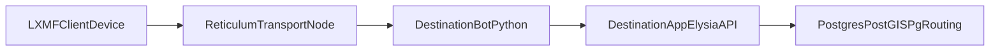

# Destination Bot Architecture

## Overview

Destination Bot is a multi-service system:

1. LXMF client sends commands over Reticulum.
2. Python bot receives commands and manages sender-scoped start state.
3. Bot calls Destination App API for route computation.
4. Destination App queries Postgres/PostGIS/pgRouting.
5. Bot formats API output and replies back over LXMF.



## Components

- Bot entrypoint: `destination_bot.py`
- Bot basic commands: `cogs/basic.py`
- Destination App API: `destination-app/src/server/api/app.ts`
- Directions logic: `destination-app/src/server/directions/service.ts`
- Compose orchestration: `docker-compose.yml`

## Message Flow

### `/start`

- Parsed by `destination_bot.py`
- Saved in bot storage (`data/directions_starts.json`) keyed by sender

### `/destination`

- Parsed by `destination_bot.py`
- Bot loads saved `/start` for sender
- Bot calls `POST /api/directions` on Destination App
- Destination App resolves locations and computes route steps
- Bot formats and returns directions over LXMF

### `/directions_clear`

- Parsed by `destination_bot.py`
- Sender-specific start state is removed from bot storage

## API Contract Used By Bot

Request:

```json
{
  "startInput": "26 Broadway, Brooklyn, NY 11249",
  "destinationInput": "200 Bedford Ave, Brooklyn, NY 11249"
}
```

Success response includes:

- `start`
- `destination`
- `steps`
- `totalDistanceM`
- `estimatedMinutes`

Error responses include:

- `error.code`
- `error.message`

## Data Dependencies

- Directions require populated routing graph tables:
  - `ways`
  - `ways_vertices_pgr`
- These are created by importing OSM data into Postgres with pgRouting tooling.

## Notes

- Active directions flow is API-proxy based via `destination_bot.py`.
- `config/cogs/directions.py` remains in repo as legacy reference and is not the active path.
